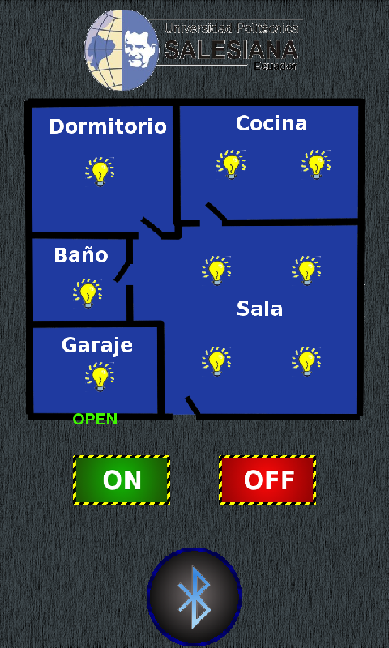
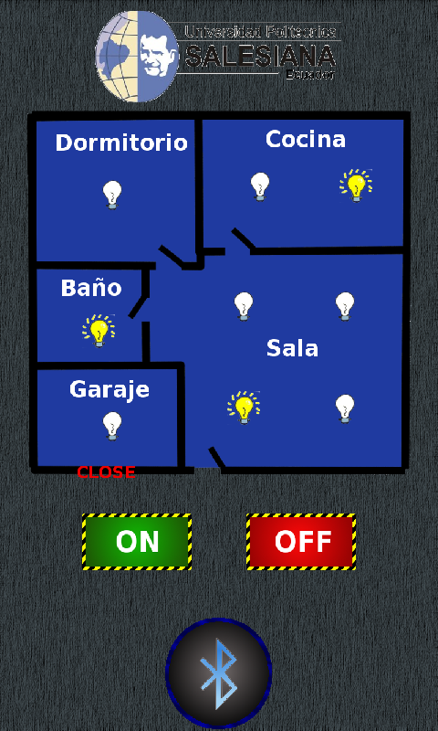
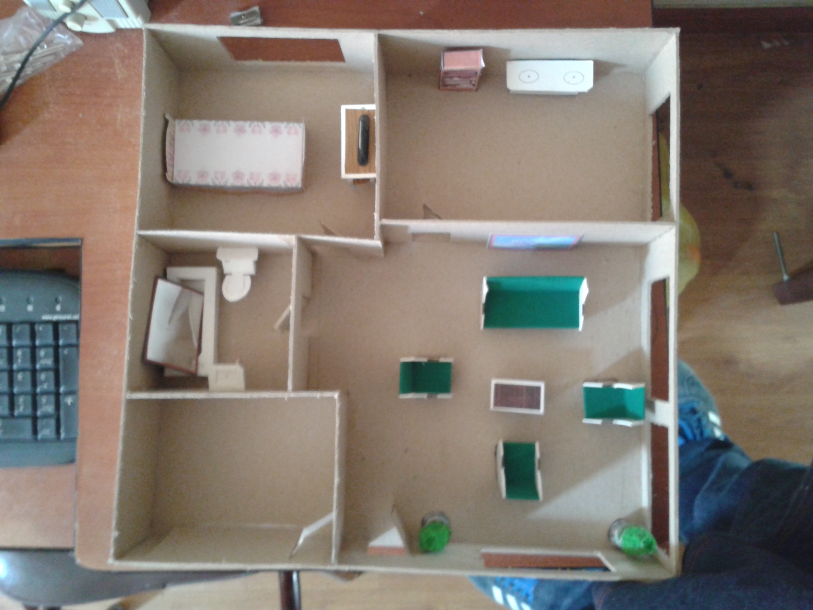
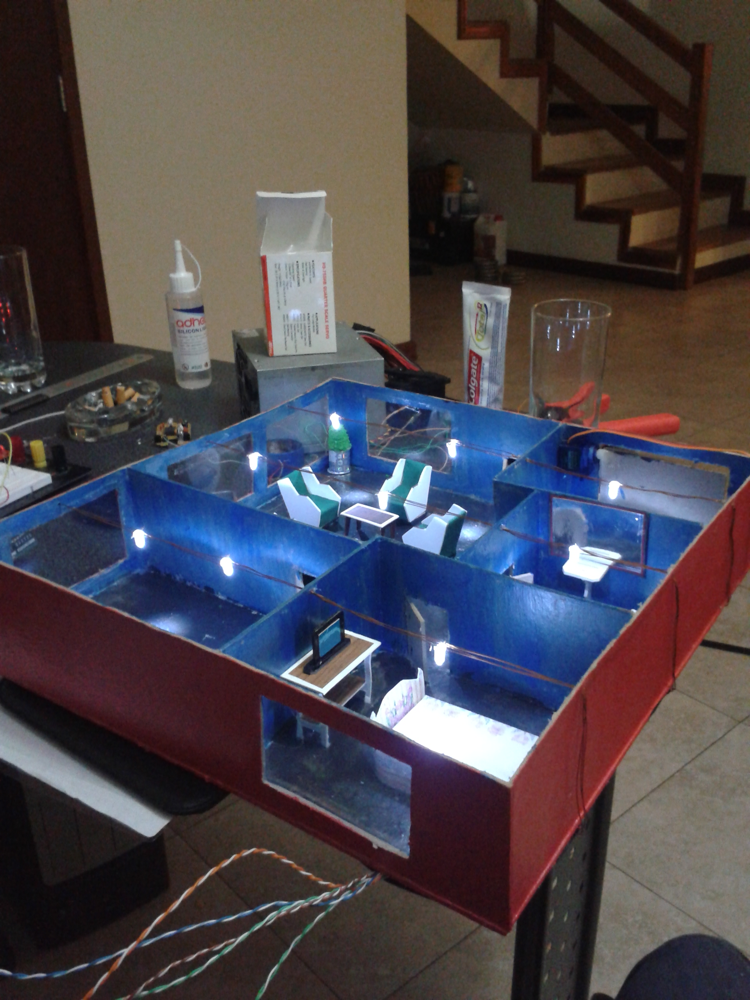

# Aplicación domótica para el control de luces del hogar

Aplicación que permite encender y apagar las luces de una maqueta además de abrir y cerrar la puerta del garaje.

## Capturas

### Aplicación

    

    

    

    

### Maqueta

    

    

